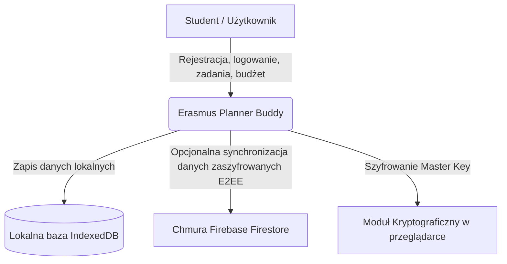
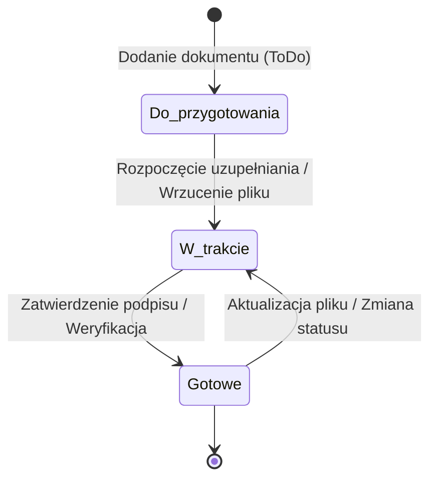

# Dokumentacja Wymagań Systemowych: Erasmus Planner Buddy
**Temat projektu:** Opracowanie systemu wspomagania planowania wyjazdów studenckich Erasmus+
**Standardy dokumentacji:** SRS (IEEE 830) + Volere Requirement Shells
**Status projektu:** Gotowy do oddania

---

## Spis treści
1. [Wprowadzenie i Kontekst Systemu](#1-wprowadzenie-i-kontekst-systemu)
2. [Interesariusze i Mapa Interesariuszy](#2-interesariusze-i-mapa-interesariuszy)
3. [Metody Pozyskiwania Wymagań](#3-metody-pozyskiwania-wymagań)
4. [Specyfikacja Wymagań Funkcjonalnych](#4-specyfikacja-wymagań-funkcjonalnych)
5. [Specyfikacja Wymagań Niefunkcjonalnych](#5-specyfikacja-wymagań-niefunkcjonalnych)
6. [User Stories i Przypadki Użycia](#6-user-stories-i-przypadki-użycia)
7. [Modelowanie (UML / BPMN / Związki)](#7-modelowanie-uml-bpmn-związki)
8. [Szablony Wymagań Volere](#8-szablony-wymagań-volere)
9. [Priorytetyzacja Wymagań (MoSCoW)](#9-priorytetyzacja-wymagań-moscow)
10. [Walidacja Wymagań (Scenariusze, Spójność)](#10-walidacja-wymagań-scenariusze-spójność)
11. [Zarządzanie Zmianą (Impact Analysis)](#11-zarządzanie-zmianą-impact-analysis)
12. [Role-Playing (Scenariusz Negocjacyjny)](#12-role-playing-scenariusz-negocjacyjny)

---

## 1. Wprowadzenie i Kontekst Systemu

### 1.1. Cel i zakres systemu
Erasmus Planner Buddy to aplikacja webowa wspomagająca studentów w pełnym cyklu przygotowań i realizacji wyjazdu w ramach programu Erasmus+ (studia lub praktyki). System rozwiązuje problem chaosu informacyjnego, zagubionych dokumentów, przekroczenia budżetów oraz wycieku danych dostępowych do zagranicznych systemów uczelnianych.

### 1.2. Kluczowe cechy
- **Bezpieczeństwo (E2EE)**: Szyfrowanie wrażliwych haseł i notatek po stronie klienta (Zero-Knowledge Architecture).
- **Dostępność (WCAG 2.1 AAA)**: Integracja z zaawansowanymi opcjami ułatwień dostępu w locie (kontrast, rozmiar czcionek, czytelność dla dyslektyków, redukcja ruchu, skala szarości).
- **Niezależność (Offline-first)**: Działanie w trybie lokalnym przy braku połączenia internetowego (baza IndexedDB) z późniejszą opcjonalną synchronizacją z chmurą Firebase Firestore.

### 1.3. Kontekst Systemu
System działa na poziomie przeglądarki użytkownika, integrując się opcjonalnie z usługą Firebase (uwierzytelnianie, baza danych, pamięć masowa) oraz lokalną bazą danych przeglądarki.



---

## 2. Interesariusze i Mapa Interesariuszy

### 2.1. Klasyfikacja interesariuszy
Interesariusze zostali podzieleni na grupy ze względu na ich wpływ oraz poziom zaangażowania w system.

1. **Użytkownicy Bezpośredni (Główni)**:
   - **Student (wyjeżdżający na studia)**: Kluczowy użytkownik. Korzysta z systemu do planowania zadań, monitorowania statusu dokumentów (np. Learning Agreement) i kontrolowania kosztów życia.
   - **Student (wyjeżdżający na praktyki)**: Wymaga specyficznych szablonów dokumentów (np. umowa o praktyki) i ubezpieczeń OC/NW.
2. **Interesariusze Zewnętrzni (Biznes/Weryfikacja)**:
   - **Koordynator Uczelni Macierzystej**: Odpowiedzialny za weryfikację i podpisywanie Learning Agreement, weryfikację ubezpieczeń oraz przyznawanie stypendiów.
   - **Koordynator Uczelni/Firmy Przyjmującej**: Weryfikuje dokumenty po stronie zagranicznej, wysyła Transcript of Records / Traineeship Certificate.
   - **Właściciel mieszkania/akomodacji**: Wymaga terminowych wpłat kaucji i czynszu, które student rejestruje w module Budżet.
3. **Techniczni**:
   - **Administrator Systemu / Deweloper**: Dba o utrzymanie infrastruktury Firebase, optymalizację aplikacji, wdrażanie poprawek WCAG i rozwój funkcji.

### 2.2. Mapa interesariuszy (Macierz Wpływ / Zainteresowanie)
- **Wysoki wpływ, wysokie zainteresowanie**: Student (Użytkownik), Koordynator Uczelni Macierzystej (Kluczowy decydent formalny).
- **Niski wpływ, wysokie zainteresowanie**: Deweloper/Administrator (Wymagania techniczne).
- **Wysoki wpływ, niskie zainteresowanie**: Dostawca usług chmurowych (Firebase), Uczelnia Partnerska.
- **Niski wpływ, niskie zainteresowanie**: Ubezpieczyciel turystyczny.

---

## 3. Metody Pozyskiwania Wymagań

W celu zdefiniowania optymalnego zestawu wymagań zastosowano trzy komplementarne techniki:

1. **Analiza Dokumentacji Programu Erasmus+**:
   - Zbadano oficjalne przewodniki Komisji Europejskiej dotyczące dokumentów wymaganych przed, w trakcie i po mobilności studenckiej.
   - Efekt: Wyodrębniono precyzyjne zestawy dokumentów dla studiów (LA, Karta EKUZ, Confirmation of Arrival, Transcript of Records) oraz praktyk (Traineeship Agreement, OC, NW, Traineeship Certificate).
2. **Wywiady ustrukturyzowane ze studentami (3 wywiady)**:
   - Przeprowadzono wywiady ze studentami, którzy odbyli wyjazd w latach 2024–2025.
   - Kluczowe wnioski: Największym stresem był brak znajomości terminów formalnych, chaos finansowy (różne waluty stypendium EUR vs wydatki PLN/lokalne) oraz obawa przed utratą danych dostępowych do zagranicznych systemów.
   - Efekt: Wprowadzenie sejfu na hasła (Vault) oraz modułu prognozowania wydatków cyklicznych.
3. **Analiza Konkurencji (Benchmarking)**:
   - Przeanalizowano oficjalną aplikację *Erasmus+ App* oraz publiczne szablony w programie *Notion*.
   - Kluczowe wnioski: Oficjalna aplikacja często miewa problemy z stabilnością i nie ma funkcji finansowych ani sejfu danych. Szablony Notion są zbyt skomplikowane i nie zapewniają poufności (brak szyfrowania).
   - Efekt: Zdecydowano się na architekturę Offline-first z lokalnym szyfrowaniem E2EE.

---

## 4. Specyfikacja Wymagań Funkcjonalnych (min. 15-20)

| ID Wymagania | Nazwa wymagania | Opis działania (funkcjonalność) |
| :--- | :--- | :--- |
| **WF-1** | Rejestracja użytkownika | System umożliwia utworzenie konta z adresem e-mail oraz hasłem (Master Key). |
| **WF-2** | Szyfrowanie po stronie klienta (E2EE) | Hasło użytkownika służy jako klucz deszyfrujący. Dane sejfu są szyfrowane w przeglądarce przed wysyłką do bazy danych. |
| **WF-3** | Logowanie demonstracyjne (Demo) | System umożliwia natychmiastowe zalogowanie na konto demo jednym przyciskiem bez podawania danych uwierzytelniających. |
| **WF-4** | Interaktywny przewodnik demo | System automatycznie uruchamia wielokrokowy samouczek nawigujący użytkownika po funkcjonalnościach pulpitu, zadań, dokumentów i budżetu. |
| **WF-5** | Działanie w trybie lokalnym (Offline) | Aplikacja zapisuje i odczytuje dane z lokalnej bazy IndexedDB w przypadku utraty połączenia internetowego. |
| **WF-6** | Automatyczna synchronizacja | Po wykryciu sieci i poprawnym zalogowaniu, system automatycznie synchronizuje lokalne dane z chmurą Firebase Firestore. |
| **WF-7** | Dodawanie zadań do checklisty | Użytkownik może dodać nowe zadanie określając tytuł, termin, priorytet (niski/średni/wysoki) oraz status (todo/done). |
| **WF-8** | Filtrowanie zadań | Użytkownik może filtrować listę zadań według ich statusu (Wszystkie, Aktywne, Ukończone). |
| **WF-9** | Oznaczanie statusu zadań | Użytkownik może jednym kliknięciem zmienić status zadania z poziomu checklisty lub pulpitu. |
| **WF-10** | Generator szablonów dokumentów | System automatycznie generuje zestaw dokumentów w zależności od wybranego typu wyjazdu (studia / praktyki) podczas konfiguracji profilu. |
| **WF-11** | Przesyłanie załączników | Użytkownik może dodać załącznik w postaci pliku (PDF, JPG, PNG) o maksymalnym rozmiarze 750 KB do wybranego dokumentu. |
| **WF-12** | Szyfrowanie plików | Pliki załączników są szyfrowane lokalnie algorytmem AES przed zapisem w bazie danych. |
| **WF-13** | Podgląd i pobieranie załączników | System umożliwia pobranie lub bezpośredni podgląd odszyfrowanego pliku w przeglądarce. |
| **WF-14** | Konfiguracja budżetu wyjazdu | Użytkownik może ustalić budżet ręcznie lub wyliczyć stypendium na podstawie miesięcznej stawki kraju docelowego i długości pobytu. |
| **WF-15** | Dodawanie wydatków | Użytkownik może dodawać wydatki, określając kwotę, walutę (EUR, PLN, USD) oraz przypisaną kategorię. |
| **WF-16** | Obsługa wydatków cyklicznych | Użytkownik może oznaczyć wydatek jako miesięczny (np. czynsz za pokój), a system automatycznie uwzględni go w prognozie całego wyjazdu. |
| **WF-17** | Prognoza budżetowa | System prognozuje łączne wydatki (koszty stałe + cykliczne x liczba miesięcy wyjazdu) i porównuje je graficznie z założonym budżetem. |
| **WF-18** | Zarządzanie niestandardowymi kategoriami | Użytkownik może tworzyć i usuwać własne kategorie budżetowe (np. rozrywka, podróże). |
| **WF-19** | Sejf na dane uwierzytelniające | Użytkownik może bezpiecznie przechowywać loginy, hasła, adresy URL oraz szyfrowane notatki do zagranicznych portali uczelnianych. |
| **WF-20** | Zarządzanie ważnymi linkami | Użytkownik może dodawać, edytować i usuwać szybkie odnośniki w panelu bocznym aplikacji. |

---

## 5. Specyfikacja Wymagań Niefunkcjonalnych (min. 10)

| ID Wymagania | Typ wymagania | Opis wymagania | Standard/Miara |
| :--- | :--- | :--- | :--- |
| **WNF-1** | Bezpieczeństwo | Przechowywanie haseł i plików załączników musi odbywać się przy użyciu szyfrowania AES-256 z kluczem Master Key. | Szyfrowanie client-side, brak wysyłki klucza na serwer. |
| **WNF-2** | Dostępność | Interfejs musi być zgodny z wytycznymi WCAG 2.1 na poziomie AAA. | Kontrast min. 7:1, opcja czcionki dla dyslektyków, powiększenie tekstu, obsługa klawiaturą. |
| **WNF-3** | Responsywność | Aplikacja musi poprawnie wyświetlać się i działać na urządzeniach mobilnych, tabletach i komputerach stacjonarnych. | Responsive Web Design, obsługa rozdzielczości od 320px do 3840px. |
| **WNF-4** | Wydajność | Czas ładowania aplikacji na łączu mobilnym 3G nie może przekraczać 3 sekund. | Initial Load Time < 3s, optymalizacja assetów przez Vite. |
| **WNF-5** | Niezawodność | Aplikacja musi zapewniać integralność danych w przypadku nagłej utraty zasilania lub sieci. | Wykorzystanie transakcji w bazie IndexedDB, zapisywanie stanu offline w pamięci lokalnej. |
| **WNF-6** | Skalowalność | Baza danych Firestore musi bez opóźnień obsługiwać do 10 000 jednoczesnych użytkowników. | Czas zapytania do bazy danych < 200ms. |
| **WNF-7** | Ograniczenie danych | Maksymalny rozmiar pojedynczego pliku załącznika dokumentu nie może przekroczyć 750 KB. | Walidacja rozmiaru po stronie klienta z komunikatem błędu. |
| **WNF-8** | Wielojęzyczność | Interfejs aplikacji musi być w pełni przetłumaczony na język polski i angielski. | Przełącznik języka w locie (i18n), zapis preferencji językowych w profilu wyjazdu. |
| **WNF-9** | Płynność ruchu | Wszystkie animacje interfejsu użytkownika muszą być zoptymalizowane pod kątem redukcji klatek. | Stabilne 60 FPS, opcja wyłączenia animacji (Reduced Motion). |
| **WNF-10**| Zgodność z przeglądarkami | Aplikacja musi być w pełni kompatybilna z najnowszymi wersjami wiodących przeglądarek. | Wsparcie dla Chrome (>= 100), Firefox (>= 100), Safari (>= 15), Edge (>= 100). |

---

## 6. User Stories i Przypadki Użycia

### 6.1. Przykładowe User Stories
1. **Jako** student przygotowujący się do wyjazdu na uczelnię w Monachium,  
   **chcę** mieć automatycznie wygenerowaną listę zadań i dokumentów na podstawie mojego kierunku i typu wyjazdu,  
   **aby** nie zapomnieć o terminach podpisania Learning Agreement.
2. **Jako** student dyslektyczny korzystający z aplikacji na telefonie,  
   **chcę** włączyć specjalną czcionkę o zwiększonych odstępach tekstu,  
   **aby** bez trudności czytać opisy procedur i wymagań niefunkcjonalnych.
3. **Jako** użytkownik sejfu haseł w aplikacji,  
   **chcę**, aby moje hasła były szyfrowane lokalnie moim kluczem Master Key,  
   **aby** nikt (nawet administratorzy chmury Firebase) nie miał dostępu do moich danych logowania.
4. **Jako** student z ograniczonym stypendium,  
   **chcę** dodać stałe koszty najmu pokoju jako wydatki cykliczne,  
   **aby** system wyliczył mi rzeczywistą prognozę finansową na cały okres pobytu.

---

## 7. Modelowanie (UML / BPMN)

### 7.1. Diagram przypadków użycia (Mermaid)

```mermaid
usecaseDiagram
    actor Student as "Student (Użytkownik)"
    actor Admin as "Administrator Systemu"
    
    Student --> (Rejestracja i logowanie)
    Student --> (Logowanie demonstracyjne)
    Student --> (Zarządzanie checklistą zadań)
    Student --> (Wrzucanie zaszyfrowanych plików)
    Student --> (Zarządzanie budżetem i wydatkami)
    Student --> (Konfiguracja opcji WCAG)
    Student --> (Przechowywanie danych w Sejfie)
    
    (Synchronizacja danych z chmurą) .> (Zapis do IndexedDB) : extends
    
    Admin --> (Utrzymanie Firebase i bazy danych)
```

### 7.2. Diagram stanów dokumentu (UML State Diagram)



---

## 8. Szablony Wymagań Volere

Poniżej przedstawiono 3 kluczowe wymagania opisane zgodnie ze ścisłym standardem szablonu wymagań Volere.

### Szablon 1: Bezpieczeństwo Sejfu (WF-2 / WNF-1)
- **Numer wymagania:** 1
- **Typ wymagania:** 11 (Wymaganie bezpieczeństwa)
- **Opis:** Dane przechowywane w Sejfie na Hasła (login, hasło, notatki) muszą być szyfrowane za pomocą algorytmu AES przed opuszczeniem przeglądarki użytkownika.
- **Uzasadnienie:** Użytkownik przechowuje tam wrażliwe dane logowania do zagranicznych systemów uczelnianych. Wyciek tych danych grozi włamaniem na konta studenta.
- **Źródło:** Wywiady ustrukturyzowane (studenci obawiali się o bezpieczeństwo danych).
- **Kryterium dopasowania:** Przechwycenie ruchu sieciowego między aplikacją a bazą Firebase Firestore wykaże wyłącznie zaszyfrowane ciągi znaków Base64. Brak możliwości odczytu danych bez znajomości hasła Master Key.
- **Priorytet:** Must Have (MoSCoW).

### Szablon 2: Dostępność WCAG (WNF-2)
- **Numer wymagania:** 2
- **Typ wymagania:** 12 (Wymaganie użyteczności i dostępności)
- **Opis:** System musi oferować zestaw przełączników dostępności (WCAG AAA) w locie, zmieniający wygląd interfejsu (kontrast, czcionkę, odstępy, ruch, skalę szarości) bez odświeżania strony.
- **Uzasadnienie:** Aplikacja jest przeznaczona dla szerokiej grupy studentów, w tym osób niedowidzących, z dysleksją czy zaburzeniami błędnika (potrzeba reduced motion).
- **Źródło:** Ustawa o dostępności cyfrowej i wymogi projektu akademickiego.
- **Kryterium dopasowania:** Narzędzia automatycznego audytu dostępności (np. Lighthouse, Axe Accessibility) wykażą 100% zgodności z wytycznymi WCAG 2.1 na poziomie AAA po włączeniu odpowiednich trybów.
- **Priorytet:** Should Have (MoSCoW).

### Szablon 3: Prognozowanie Budżetu (WF-17)
- **Numer wymagania:** 3
- **Typ wymagania:** 9 (Wymaganie funkcjonalne)
- **Opis:** System musi automatycznie mnożyć wydatki oznaczone jako cykliczne przez liczbę miesięcy trwania wyjazdu (pobraną z dat wyjazdu) i sumować je z wydatkami jednorazowymi.
- **Uzasadnienie:** Zapobiega to błędnemu szacowaniu budżetu przez studenta, który widzi tylko pojedynczy koszt miesięczny zamiast skumulowanego kosztu całego pobytu.
- **Źródło:** Analiza konkurencji i wywiady ze studentami.
- **Kryterium dopasowania:** Użytkownik deklaruje wyjazd na 5 miesięcy, dodaje czynsz 400 EUR jako miesięczny. Prognoza budżetowa natychmiast wykazuje koszt 2000 EUR w podsumowaniu.
- **Priorytet:** Should Have (MoSCoW).

---

## 9. Priorytetyzacja Wymagań (MoSCoW)

Wymagania zostały spriorytetyzowane metodą MoSCoW. Uzasadnienia przypisania priorytetów wynikają z analizy ryzyka i wartości dla użytkownika.

### 9.1. Tablica Priorytetów

| Priorytet | ID Wymagań | Uzasadnienie |
| :--- | :--- | :--- |
| **Must Have** | WF-1, WF-2, WF-5, WF-7, WF-10, WF-14, WF-15, WNF-1, WNF-3 | **Krytyczne dla działania aplikacji**. Bez konta, checklisty zadań, podstawowego budżetu oraz szyfrowania danych aplikacja traci swoją podstawową tożsamość produktową i nie spełnia celów biznesowych. |
| **Should Have** | WF-3, WF-4, WF-11, WF-12, WF-16, WF-17, WF-19, WNF-2, WNF-8 | **Wysoka wartość dodana**. Zapewnia doskonałe wrażenia użytkownika (UX), umożliwia bezproblemowe testowanie (konto demo, przewodnik), dodawanie załączników oraz kluczowe opcje dostępności (WCAG) i wielojęzyczność. |
| **Could Have** | WF-6, WF-13, WF-18, WF-20, WNF-9, WNF-10 | **Opcjonalne udogodnienia**. Automatyczna synchronizacja w tle, niestandardowe kategorie wydatków oraz zaawansowana redukcja ruchu zwiększają wygodę, ale system zachowuje pełną sprawność bez nich. |
| **Won't Have** | Automatyczne pobieranie kursów walut z API NBP, czat z koordynatorem w czasie rzeczywistym. | **Odłożone na przyszłość**. Wymagałyby integracji z zewnętrznymi API oraz budowy serwera czatu, co wykracza poza obecny zakres projektu grupowego. |

---

## 10. Walidacja Wymagań (Scenariusze, Spójność)

### 10.1. Checklist Jakości Wymagań (Volere Quality Gateway)
- **Kompletność**: Czy każde wymaganie ma zdefiniowane kryterium dopasowania? (Tak, opisane w Volere).
- **Spójność**: Czy wymagania nie są sprzeczne? (Sprawdzone: np. tryb offline i synchronizacja chmurowa są komplementarne dzięki architekturze offline-first).
- **Testowalność**: Czy każde wymaganie można zweryfikować testem? (Tak, kryteria dopasowania są mierzalne).

### 10.2. Scenariusze Testowe do Walidacji
1. **Scenariusz ST-1: Szyfrowanie haseł w Sejfie (WF-2 / WNF-1)**
   - *Krok 1:* Zaloguj się jako użytkownik testowy.
   - *Krok 2:* Przejdź do zakładki Sejf, podaj hasło Master Key i dodaj konto (np. USOS, hasło: `TajneHaslo123`).
   - *Krok 3:* Sprawdź lokalną bazę Zustand – hasło wyświetla się jako jawny tekst dla użytkownika.
   - *Krok 4:* Otwórz konsolę sieciową przeglądarki i sprawdź ładunek wysyłany do Firebase Firestore.
   - *Oczekiwany rezultat:* W bazie danych zapisany jest wyłącznie nieczytelny szyfrogram (np. `U2FsdGVkX1...`).
2. **Scenariusz ST-2: Działanie trybu offline i synchronizacja (WF-5 / WF-6)**
   - *Krok 1:* Uruchom aplikację i przejdź w tryb offline (wyłącz kartę sieciową).
   - *Krok 2:* Dodaj nowe zadanie "Kupić walizkę".
   - *Krok 3:* Odśwież stronę (nadal offline). Upewnij się, że zadanie nadal jest widoczne (odczyt z IndexedDB).
   - *Krok 4:* Włącz połączenie internetowe.
   - *Oczekiwany rezultat:* Aplikacja wykrywa sieć i synchronizuje zadanie z Firebase Firestore bez utraty danych.
3. **Scenariusz ST-3: Aktywacja opcji dostępności WCAG (WNF-2)**
   - *Krok 1:* Kliknij pływający widget dostępności w prawym dolnym rogu.
   - *Krok 2:* Włącz przełącznik "Czcionka dla dyslektyków".
   - *Oczekiwany rezultat:* Element `html` otrzymuje klasę `.dyslexia-font`, a krój pisma w całej aplikacji zmienia się na czcionkę o podwyższonej czytelności.

---

## 11. Zarządzanie Zmianą (Impact Analysis)

### 11.1. Zmiana 1: Wprowadzenie automatycznego przeliczania walut w module Budżet
- **Opis zmiany:** Klient żąda, aby aplikacja automatycznie przeliczała wydatki w PLN i USD na walutę EUR na podstawie aktualnych kursów z API Europejskiego Banku Centralnego (EBC) zamiast statycznych przeliczników.
- **Impact Analysis (Analiza wpływu):**
  - **Kod źródłowy:** Modyfikacja funkcji `toEUR` w `use-planner-store.ts` (zamiana statycznego obiektu `RATES` na asynchroniczne pobieranie danych).
  - **Wydajność:** Potrzeba obsłużenia stanu ładowania kursów przy starcie aplikacji. Możliwe opóźnienie w renderingu podsumowania budżetu.
  - **Niezawodność (Tryb offline):** API nie zadziała w trybie offline. Wymagany mechanizm awaryjny (fallback) korzystający z ostatnio zapisanych kursów w `localStorage`.
- **Decyzja projektowa:** Zmiana zostaje zaakceptowana z priorytetem *Should Have*. Dodane zostanie cache'owanie kursów walut.

### 11.2. Zmiana 2: Dodanie roli Koordynatora Erasmus jako użytkownika systemu
- **Opis zmiany:** Uczelnia wnioskuje o stworzenie panelu dla Koordynatorów, aby mogli bezpośrednio w aplikacji przeglądać i zatwierdzać dokumenty wgrane przez studentów.
- **Impact Analysis (Analiza wpływu):**
  - **Bezpieczeństwo (Krytyczne):** Złamanie architektury E2EE. Koordynator nie zna hasła Master Key studenta, więc nie odszyfruje plików załączników przechowywanych w chmurze studenta.
  - **Architektura:** Wymagałoby to wdrożenia kryptografii asymetrycznej (klucze publiczne/prywatne koordynatora i studenta) i ponownego zaszyfrowania klucza pliku kluczem publicznym koordynatora.
  - **Czas realizacji:** Szacowany czas implementacji to dodatkowe 4 tygodnie pracy deweloperskiej.
- **Decyzja projektowa:** Odrzucono w obecnej fazie projektu ze względu na wysokie koszty i drastyczny wzrost skomplikowania bezpieczeństwa. Alternatywa: student może wyeksportować odszyfrowany plik i wysłać go tradycyjnym e-mailem.

---

## 12. Role-Playing (Scenariusz Negocjacyjny)

Aby zasymulować realną pracę nad wymaganiami w zespole, członkowie grupy odegrali role podczas spotkania projektowego w dniu 15 czerwca 2026 r.

### Uczestnicy spotkania:
- **Janek (w roli Studenta - Użytkownika Końcowego)**
- **Kasia (w roli Specjalisty ds. Cyberbezpieczeństwa / Administratora)**
- **Michał (w roli Analityka Wymagań / Dewelopera)**

### Transkrypcja negocjacji (Negocjowanie resetowania hasła):
> **Janek (Student):** Słuchajcie, sejf haseł jest super, ale co się stanie, jeśli zapomnę mojego hasła Master Key do konta? Musi być opcja "Przypomnij hasło" albo "Zresetuj hasło" przez e-mail, tak jak w każdym normalnym serwisie!
>
> **Kasia (Cyberbezpieczeństwo):** Absolutnie się nie zgadzam. Nasza aplikacja reklamuje się jako w pełni bezpieczna i chroniąca prywatność (Zero-Knowledge). Szyfrujemy dane kluczem generowanym z Twojego hasła. Jeśli zapomnisz hasła, nie mamy technicznej możliwości odzyskania Twoich danych na serwerze, bo my ich nie znamy. Opcja resetu hasła przez e-mail oznaczałaby, że przechowujemy klucze na serwerze, a to niweczy całe E2EE!
>
> **Michał (Deweloper):** Kasia ma rację z punktu widzenia bezpieczeństwa. Ale Janek ma rację pod kątem użyteczności. Zwykły użytkownik po prostu porzuci aplikację, jeśli straci dane. Musimy znaleźć kompromis.
>
> **Kasia (Cyberbezpieczeństwo):** Kompromis to wygenerowanie jednorazowego kodu odzyskiwania (Recovery Key) o wysokiej entropii podczas rejestracji, który użytkownik musi zapisać na kartce. Klucz ten jest szyfrowany dodatkowym schematem. Jeśli zapomni hasła, może zresetować konto pod warunkiem podania Recovery Key. Jeśli zgubi oba – dane przepadają bezpowrotnie.
>
> **Janek (Student):** To brzmi rozsądnie. Będę miał kod ratunkowy w bezpiecznym miejscu, a aplikacja wciąż będzie w 100% bezpieczna. Dodajmy to jako wymaganie *Should Have* na kolejny sprint.
>
> **Michał (Deweloper):** Zapisuję to wymaganie w specyfikacji Volere pod ID: WF-21 (Generowanie klucza ratunkowego odzyskiwania profilu).
